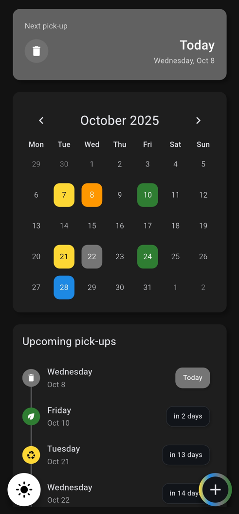
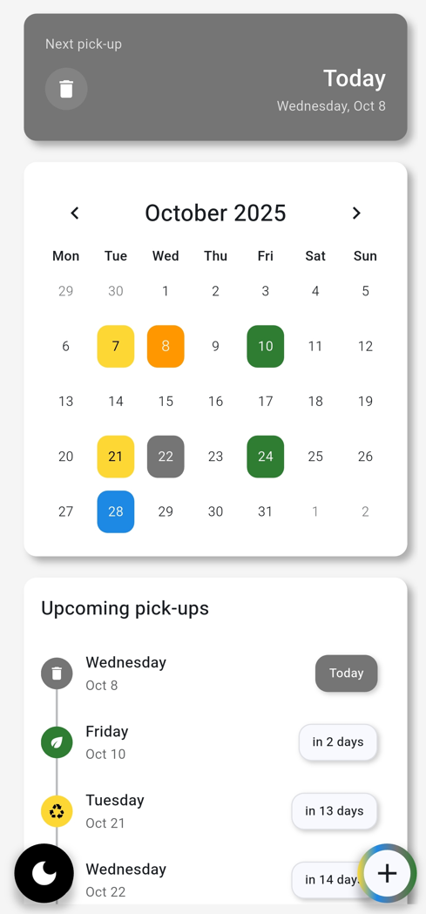

# 🗑️ Trashifier

A Flutter-based mobile application that helps you never miss trash collection day again! Trashifier is your personal waste management assistant that keeps track of different types of trash pickup schedules and sends you timely notifications.

## 🖼️ Screens




## 📱 Features

### 🗓️ Calendar Management
- **Interactive Calendar View**: Visual calendar showing all your trash pickup dates with color-coded indicators
- **Multiple Trash Types**: Support for different waste categories:
  - 🟡 Plastic waste
  - 🔵 Paper waste
  - ⚫ General trash
  - 🟢 Bio/Organic waste
- **Easy Date Selection**: Add, remove, or modify pickup dates with an intuitive calendar interface
- **Visual Indicators**: Color-coded calendar days showing which type of trash gets collected when

### 🔔 Smart Notifications
- **Automated Reminders**: Get notified the evening before (7 PM) each trash collection day
- **Custom Notifications**: Tailored notification messages for each trash type; several bins on the same day get separate reminders 20 seconds apart
- **Exact Alarm Scheduling**: Uses Android's exact alarm permissions for precise timing
- **Self-healing Schedule**: Reminders are re-armed on every app start, after a reboot and after an app update

### 📱 Home Screen Widget
- Shows the next pickup day and how many days are left
- When several bins go out the same day, shows their colors side by side (up to three)

### 📋 Pickup Timeline
- **Next Pickup Highlight**: Prominent display of your next upcoming trash collection
- **Upcoming Pickups List**: Timeline view showing all future collection dates
- **Days Until Counter**: See exactly how many days until each pickup
- **Smart Sorting**: Automatically sorts pickups by date and priority

### 🎨 User Experience
- **System/Light/Dark Theme**: Follows the system theme by default; tap the theme button to cycle through system, light and dark
- **Material Design**: Modern, clean interface following Material Design principles
- **Responsive Layout**: Optimized for different screen sizes and orientations
- **Persistent Storage**: Your pickup schedules are saved locally and persist between app sessions

### 🔧 Technical Features
- **Android**: Built with Flutter, targeting Android only
- **Local Storage**: Uses SharedPreferences for reliable data persistence
- **Background Processing**: Handles notifications even when the app is closed
- **Permission Management**: Proper handling of notification and alarm permissions
- **Timezone Support**: Pickup dates are stored as calendar days, so they never shift between time zones

## 🚀 Getting Started

### Prerequisites
- Flutter SDK (^3.8.1)
- Android Studio / VS Code
- Android device or emulator (API level 24+)

### Installation

1. **Clone the repository**
   ```bash
   git clone https://github.com/Aboliss/trashifier_app.git
   cd trashifier_app
   ```

2. **Install dependencies**
   ```bash
   flutter pub get
   ```

3. **Run the app**
   ```bash
   flutter run
   ```

## 📖 How to Use

1. **First Launch**: Open the app and grant notification permissions when prompted
2. **Add Pickup Dates**: Use the floating action buttons to add dates for different trash types
3. **Set Your Schedule**: Select dates on the calendar for each type of waste collection
4. **Enable Notifications**: Make sure notifications are enabled to receive reminders
5. **Stay Organized**: Check the timeline view to see all upcoming pickups at a glance

## 🏗️ Architecture

The app follows a clean architecture pattern with:

- **Models**: Data structures for trash dates and types
- **Services**: Background services for notifications and storage
- **Widgets**: Reusable UI components
- **Helpers**: Utility functions for dates, colors, and formatting
- **Pages**: Main app screens and navigation

## 📦 Dependencies

- `table_calendar` - Interactive calendar widget
- `flutter_local_notifications` - Local notification handling
- `shared_preferences` - Local data storage
- `provider` - State management
- `timeline_tile` - Timeline UI components
- `flutter_expandable_fab` - Expandable floating action button

## 🚢 Releasing

Pushing a tag that matches the `version` in `pubspec.yaml` (e.g. `v1.2.0`) builds a signed APK and AAB and publishes a GitHub release. Every release must be signed with the same key, otherwise Android refuses to install it as an update.

One-time setup:

1. Create an upload keystore (keep it and its passwords somewhere safe; losing it means users must reinstall):
   ```bash
   keytool -genkey -v -keystore upload-keystore.jks -keyalg RSA -keysize 2048 -validity 10000 -alias upload
   ```
2. Add these repository secrets (Settings → Secrets and variables → Actions):
   - `ANDROID_KEYSTORE_BASE64`: output of `base64 -w0 upload-keystore.jks`
   - `ANDROID_KEYSTORE_PASSWORD`, `ANDROID_KEY_ALIAS`, `ANDROID_KEY_PASSWORD`
3. For local signed builds, create `android/key.properties` (git-ignored):
   ```properties
   storeFile=/absolute/path/to/upload-keystore.jks
   storePassword=...
   keyAlias=upload
   keyPassword=...
   ```

Without `key.properties`, release builds fall back to the debug key, which is fine for local testing only.

## 🤝 Contributing

1. Fork the repository
2. Create your feature branch (`git checkout -b feature/AmazingFeature`)
3. Commit your changes (`git commit -m 'Add some AmazingFeature'`)
4. Push to the branch (`git push origin feature/AmazingFeature`)
5. Open a Pull Request

## 📄 License

This project is licensed under the MIT License - see the [LICENSE](LICENSE) file for details.

## 🙋‍♂️ Support

If you encounter any issues or have suggestions for improvement, please open an issue on GitHub.

## 🌟 Acknowledgments

- Built with [Flutter](https://flutter.dev/)
- Icons and design inspired by Material Design principles
- Thanks to the Flutter community for the amazing packages used in this project

---

**Never miss trash day again with Trashifier!** 🎯
